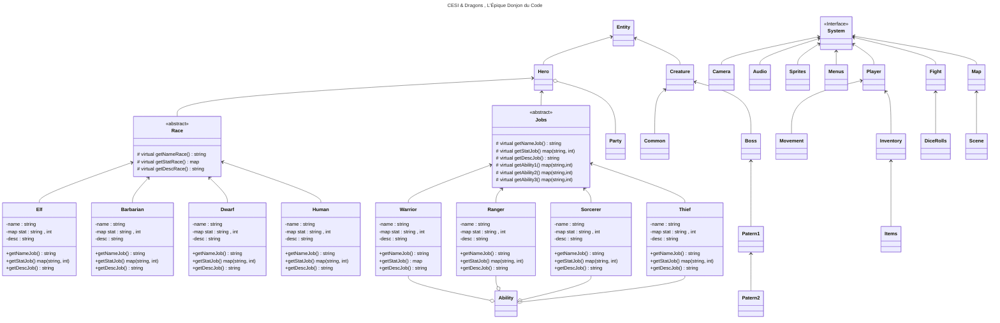

```mermaid
---
title: CESI & Dragons , L'Épique Donjon du Code
---
classDiagram
    class Entity {

    }

    class Hero {

    }

    class Creature {

    }

    class Party {

    }

    class Jobs {
        <<abstract>>
        # virtual getNameJob() string
        # virtual getStatJob() map(string, int)
        # virtual getDescJob() string
        # virtual getAbility1() map(string,int)
        # virtual getAbility2() map(string,int)
        # virtual getAbility3() map(string,int)
    }

    class Race {
        <<abstract>>
        # virtual getNameRace() string
        # virtual getStatRace() map<string, int>
        # virtual getDescRace() string


    }

    class Boss {

    }

    class Common {

    }

    class Inventory {

    }

    class Menus {

    }

    class Patern1 {

    }

    class Patern2 {

    }

    class Movement {

    }

    class Sprites {

    }

    class Camera {

    }

    class Audio {

    }

    class Scene{

    }

    class Map{

    }

    class Ability {

    }

    class DiceRolls {

    }

    class Items{

    }

    class Elf {
        -name : string 
        -map stat : string , int
        -desc : string
        +getNameJob() string
        +getStatJob() map(string, int)
        +getDescJob() string

    }

    class Warrior {
        -name : string 
        -map stat : string , int
        -desc : string
        +getNameJob() string
        +getStatJob() map<string, int>
        +getDescJob() string
    }

    class Ranger {
        -name : string 
        -map stat : string , int
        -desc : string
        +getNameJob() string
        +getStatJob() map(string, int)
        +getDescJob() string
    }

    class Sorcerer{
        -name : string 
        -map stat : string , int
        -desc : string
        +getNameJob() string
        +getStatJob() map(string, int)
        +getDescJob() string
    }

    class Thief {
        -name : string 
        -map stat : string , int
        -desc : string
        +getNameJob() string
        +getStatJob() map(string, int)
        +getDescJob() string
    }

    class Dwarf {
        -name : string 
        -map stat : string , int
        -desc : string
        +getNameJob() string
        +getStatJob() map(string, int)
        +getDescJob() string
    }

    class Human {
        -name : string 
        -map stat : string , int
        -desc : string
        +getNameJob() string
        +getStatJob() map(string, int)
        +getDescJob() string
    }

    class Barbarian {
        -name : string 
        -map stat : string , int
        -desc : string
        +getNameJob() string
        +getStatJob() map(string, int)
        +getDescJob() string
    }

    class System {
        <<Interface>>
    }

    class Player {

    }

    class Fight {

    }

Entity <--Hero
Hero <-- Race
Hero <-- Jobs
Entity <-- Creature
Creature <-- Common
Creature <-- Boss
Boss <-- Patern1
Patern1 <-- Patern2
Hero o-- Party
Jobs <-- Warrior
Race <-- Elf
Race <-- Barbarian
Race <-- Dwarf
Race <-- Human
Jobs <-- Ranger
Jobs <-- Sorcerer
Jobs <-- Thief
System <-- Camera
System <-- Audio
System <-- Sprites
System <-- Menus
System <-- Player
Player <-- Movement
System <-- Fight
Fight <-- DiceRolls
System <-- Map
Map <-- Scene
Warrior --o Ability
Ranger --o Ability
Sorcerer --o Ability
Thief --o Ability
Inventory <-- Items
Player <-- Inventory
```
