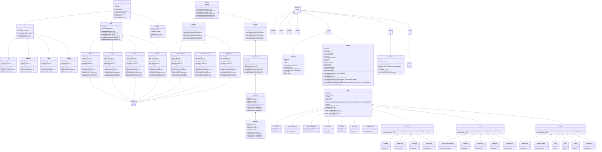

```mermaid

classDiagram
    class Hero {
        -HeroName string
        - Health int

        + Heroes (string)
        + getHeroStat() map(string, int)
        + getHeroName() string
        + getHeroDesc() string
        + getHealth () int
        + StatComparison () bool

    }

    class Creature {
        <<abstract>>
        # virtual getNameCreature() string
        # virtual getStatCreature() map(string, int)
        # virtual getDescCreature() string
        # virtual getAbility1(string) map(string,int)
        # virtual getAbility2(string) map(string,int)
        # virtual getAbility3(string) map(string,int)
    }

    class Party {
        -HeroParty vector
        -CreatureParty vector
        +getHeroParty() vector
        +getcreatureParty() vector
    }

    class Jobs {
        - nda string
        - map nullMap: string, int

        + virtual getNameJob() string
        + virtual getStatJob() map(string, int)
        + virtual getDescJob() string
        + virtual getAbility1(string) map(string,int)
        + virtual getAbility2(string) map(string,int)
        + virtual getAbility3(string) map(string,int)
    }

    class Race {
        - nda string
        - map nullMap : string, int

        + virtual getNameRace() string
        + virtual getStatRace() map<string, int>
        + virtual getDescRace() string
    }

    class Boss {
        <<abstract>>
        # virtual getNameCreature() string
        # virtual getStatCreature() map(string, int)
        # virtual getDescCreature() string
        # virtual getAbility1(string) map(string,int)
        # virtual getAbility2(string) map(string,int)
        # virtual getAbility3(string) map(string,int)
    }

    class ProgramLich{
        - name string
        - desc string
        + getNameCreature() string
        + getDescCreature() string
        # virtual getStatCreature() map(string, int)
        # virtual getAbility1(string) map(string,int)
        # virtual getAbility2(string) map(string,int)
        # virtual getAbility3(string) map(string,int)
    }

    class Common {
        <<abstract>>
        # virtual getNameCreature() string
        # virtual getStatCreature() map(string, int)
        # virtual getDescCreature() string
        # virtual getAbility1(string) map(string,int)
        # virtual getAbility2(string) map(string,int)
        # virtual getAbility3(string) map(string,int)
    }

    class SarcasticGobelin{
        -name : string
        -map stat : string , int
        -map Ability1 : string , int
        -map Ability2 : string , int
        -map Ability3 : string , int
        -desc : string
        +getNameCreature() string
        +getStatCreature() map(string, int)
        +getDescCreature() string
        + getAbility1(string) map(string,int)
        + getAbility2(string) map(string,int)
        + getAbility3(string) map(string,int)
    }

    class RhetoricianTroll{
        -name : string
        -map stat : string , int
        -map Ability1 : string , int
        -map Ability2 : string , int
        -map Ability3 : string , int
        -desc : string
        +getNameCreature() string
        +getStatCreature() map(string, int)
        +getDescCreature() string
        + getAbility1(string) map(string,int)
        + getAbility2(string) map(string,int)
        + getAbility3(string) map(string,int)
    }

    class ExplosiveDuck {
        -name : string
        -map stat : string , int
        -map Ability1 : string , int
        -map Ability2 : string , int
        -map Ability3 : string , int
        -desc : string
        +getNameCreature() string
        +getStatCreature() map(string, int)
        +getDescCreature() string
        + getAbility1(string) map(string,int)
        + getAbility2(string) map(string,int)
        + getAbility3(string) map(string,int)
    }

    class Inventory {
        - size_t rows
        - size_t cols
        - size_t slotSize
        - vector<vector<Items*>> inventoryGrid
        - Items* selectedItem
        - Font& font
        - RectangleShape infoPanel
        - Text infoText
        - bool isOpen
        - Items* weaponSlot
        - Items* chestSlot
        - Items* bootsSlot
        - Vector2f weaponSlotPos
        - Vector2f chestSlotPos
        - Vector2f bootsSlotPos

        + Inventory(size_t rows, size_t cols, Font& font)
        + void toggleInventory()
        + bool getIsOpen() const
        + void addItem(size_t row, size_t col, Items* item)
        + void handleMouseClick(Vector2i mousePos, RenderWindow& window)
        + void unequipItem(const string& slotType)
        + void drawEquipmentSlot(RenderWindow& window, Vector2f position, Items* item, const string& label)
        + void draw(RenderWindow& window)
    }

    class Menus {

    }

    class Pattern1 {
        -map stat : string , int
        -map Ability1 : string , int
        -map Ability2 : string , int
        -map Ability3 : string , int
        + get getStat() map (string, int)
        + getAbility1(string) map(string,int)
        + getAbility2(string) map(string,int)
        + getAbility3(string) map(string,int)
    }

    class Pattern2 {
        -map stat : string , int
        -map Ability1 : string , int
        -map Ability2 : string , int
        -map Ability3 : string , int
        + get getStat() map (string, int)
        + getAbility1(string) map(string,int)
        + getAbility2(string) map(string,int)
        + getAbility3(string) map(string,int)
    }

    class Movement {
        - speed float
        - x float
        - y float
        + Movement(float initialSpeed)
        + getSpeed() float
        + void setSpeed(float newSpeed)
        + void move(sf::Vector2f &mapOffset)
        + getX() float
        + getY() float
    }

    class Sprites {

    }

    class Camera {

    }

    class Audio {

    }

    class Scene{

    }

    class Map{

    }

    class Ability {

    }

    class DiceRolls {
        -int sides
        -unsigned long seed
        -unsigned long random()
        +DiceRoll(int sides=6, unsigned long initialSeed=1)
        +int roll()
        +int getSides() const
        +void setSides(int newSides)
        +void setSeed(unsigned long newSeed)
    }

    class Items{
        - string name
        - string description
        - map<string, int> stats
        - Texture texture
        - Sprite sprite

        + Items(const string& name, const string& description, const map<string, int>& stats, const string& spritePath)
        + ~Items()
        + bool isChestArmor() const
        + bool isBoots() const
        + bool isWeapon() const
        + const string& getName() const
        + const string& getDescription() const
        + const map<string, int>& getStats() const
        + const Sprite& getSprite() const
    }

    class ChestArmor {
        + ChestArmor(const string& name, const string& description, const map<string, int>& stats, const string& spritePath)
        + bool isChestArmor() const
    }

    class Boots {
        + Boots(const string& name, const string& description, const map<string, int>& stats, const string& spritePath)
        + bool isBoots() const
    }

     class Weapon {
        + Weapon(const string& name, const string& description, const map<string, int>& stats, const string& spritePath)
        + bool isWeapon() const
    }


    class Elf {
        -name : string
        -map stat : string , int
        -desc : string
        # getNameJob() string
        # getStatJob() map(string, int)
        # getDescJob() string
    }

    class Warrior {
        -name : string
        -map stat : string , int
        -map Ability1 : string , int
        -map Ability2 : string , int
        -map Ability3 : string , int
        -desc : string
        # getNameJob() string
        # getStatJob() map(string, int)
        # getDescJob() string
        # getAbility1(string) map(string,int)
        # getAbility2(string) map(string,int)
        # getAbility3(string) map(string,int)
    }

    class Ranger {
        -name : string
        -map stat : string , int
        -map Ability1 : string , int
        -map Ability2 : string , int
        -map Ability3 : string , int
        -desc : string
        # getNameJob() string
        # getStatJob() map(string, int)
        # getDescJob() string
        # getAbility1(string) map(string,int)
        # getAbility2(string) map(string,int)
        # getAbility3(string) map(string,int)
    }

    class Sorcerer{
        -name : string
        -map stat : string , int
        -map Ability1 : string , int
        -map Ability2 : string , int
        -map Ability3 : string , int
        -desc : string
        # getNameJob() string
        # getStatJob() map(string, int)
        # getDescJob() string
        # getAbility1(string) map(string,int)
        # getAbility2(string) map(string,int)
        # getAbility3(string) map(string,int)
    }

    class Thief {
        -name : string
        -map stat : string , int
        -map Ability1 : string , int
        -map Ability2 : string , int
        -map Ability3 : string , int
        -desc : string
        # getNameJob() string
        # getStatJob() map(string, int)
        # getDescJob() string
        # getAbility1(string) map(string,int)
        # getAbility2(string) map(string,int)
        # getAbility3(string) map(string,int)
    }

    class Dwarf {
        -name : string
        -map stat : string , int
        -desc : string
        # getNameJob() string
        # getStatJob() map(string, int)
        # getDescJob() string
    }

    class Human {
        -name : string
        -map stat : string , int
        -desc : string
        # getNameJob() string
        # getStatJob() map(string, int)
        # getDescJob() string
    }

    class Barbarian {
        -name : string
        -map stat : string , int
        -desc : string
        # getNameJob() string
        # getStatJob() map(string, int)
        # getDescJob() string
    }

    class System {
        <<Interface>>
    }

    class Player {

    }

    class Fight {

    }

    class BeerPotion{
        +BeerPotion
    }

    class PotionIntelligence {
        +PotionIntelligence()
    }

    class MajorHealingPotion {
        +MajorHealingPotion
    }

    class RustyKey {
        +RustyKey
    }

    class KeyCorridor {
        +KeyCorridor()
    }

    class RopeTrap {
        +RopeTrap()
    }

    class BookOfLostRules {
        +BookOfLostRules()
    }

    
    class DiscretionShoesNoisy {
        +DiscretionShoesNoisy()
    }

    class StealBoots {
        +StealBoots()
    }

    class DarkBoots {
        +DarkBoots()
    }

    class SorcererBoots {
        +SorcererBoots()
    }

    class LeatherBoots {
        +LeatherBoots()
    } 

    class BluntSword {
        +BluntSword()
    }

    class Bow {
        +Bow()
    }

    class Dagger {
        +Dagger()
    }

    class Sword {
        +Sword()
    }

    class SorcererStick {
        +SorcererStick()
    }

    class ScepterSyntactic {
        +ScepterSyntactic()
    }

    class DarkCape {
        +DarkCape()
    }

    class ChainMail {
        +ChainMail()
    }

    class LeatherChest {
        +LeatherChest()
    }

    class SorcererCape {
        +SorcererCape()
    }


   
    Hero --o Race
    Hero --o Jobs
   
    Creature <-- Common
    Creature <-- Boss
    Boss <-- ProgramLich
    ProgramLich <-- Pattern1
    Pattern1 <-- Pattern2
    Hero o-- Party
    Jobs <-- Warrior
    Race <-- Elf
    Race <-- Barbarian
    Race <-- Dwarf
    Race <-- Human
    Jobs <-- Ranger
    Jobs <-- Sorcerer
    Jobs <-- Thief
    System <-- Camera
    System <-- Audio
    System <-- Sprites
    System <-- Menus
    System <-- Player
    Player <-- Movement
    System <-- Fight
    Fight <-- DiceRolls
    System <-- Map
    Map <-- Scene
    Warrior --o Ability
    Ranger --o Ability
    Sorcerer --o Ability
    Thief --o Ability
    RhetoricianTroll --o Ability
    ExplosiveDuck --o Ability
    SarcasticGobelin --o Ability
    Inventory <-- Items
    Player <-- Inventory
    Common <-- RhetoricianTroll
    Common <-- SarcasticGobelin
    Common <-- ExplosiveDuck
    
    Items <-- BeerPotion
    Items <-- PotionIntelligence       
    Items <-- MajorHealingPotion
    Items <-- KeyCorridor
    Items <-- RustyKey
    Items <-- RopeTrap
    Items <-- BookOfLostRules
    Items <-- ChestArmor
    Items <-- Boots
    Items <-- Weapon
    ChestArmor <-- ChainMail  
    ChestArmor <-- LeatherChest
    ChestArmor <-- DarkCape
    ChestArmor <-- SorcererCape
    Boots <-- DiscretionShoesNoisy
    Boots <-- StealBoots
    Boots <-- LeatherBoots
    Boots <-- DarkBoots
    Boots <-- SorcererBoots
    Weapon <-- BluntSword
    Weapon <-- ScepterSyntactic
    Weapon <-- Sword
    Weapon <-- Bow
    Weapon <-- Dagger
    Weapon <-- SorcererStick

```
